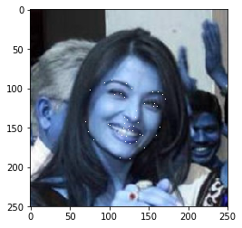
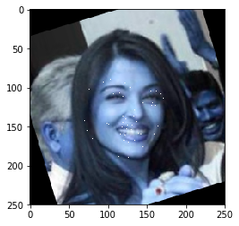
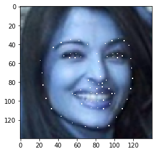

最近在实现Pairwise Relational Networks for Face Recognition论文，预处理人脸时发现资料没那么好找，现整理成jupyter文档方便回顾。预处理的总体流程：

* 人脸关键点检测
* 根据眼部关键点旋转图片做人脸对齐
* 旋转人脸关键点，使其与对齐后的图片匹配
* 根据关键点裁剪人脸到固定尺寸
* 变换人脸关键点，使其与裁剪后的图片匹配

## 1 Imports


```python
import cv2
import numpy as np
import math
from collections import defaultdict
from PIL import Image,ImageDraw
from matplotlib.pyplot import imshow
%matplotlib inline
import matplotlib.pyplot as plt
import face_recognition  # install from https://github.com/ageitgey/face_recognition
```

## 2 导入图片


```python
img_name = '/home/dataset/face_recognize/lfw_test/Aishwarya_Rai/Aishwarya_Rai_0001.jpg'
image_array = cv2.imread(img_name)
Image.fromarray(image_array
```


## 3 人脸检测
使用[face_recognition api](https://github.com/ageitgey/face_recognition)检测人脸的关键点， model="large"时返回68个关键点， model="small"时返回5个关键点。


```python
face_landmarks_list = face_recognition.face_landmarks(image_array, model="large")
face_landmarks_dict = face_landmarks_list[0]
print(face_landmarks_dict, end=" ")
```

```python
'''out
{'chin': [(76, 102), (74, 115), (72, 128), (70, 142), (73, 155), (80, 165), (90, 175), (102, 183), (114, 188), (126, 189), (136, 183), (145, 176), (152, 168), (159, 159), (164, 149), (167, 138), (169, 128)],
'left_eyebrow': [(94, 93), (103, 90), (113, 90), (122, 94), (129, 100)], 
'right_eyebrow': [(147, 105), (155, 104), (162, 104), (168, 108), (171, 114)], 
'nose_bridge': [(136, 113), (135, 121), (134, 129), (133, 137)], 
'nose_tip': [(119, 137), (123, 140), (128, 144), (133, 144), (137, 143)],
'left_eye': [(102, 105), (109, 105), (115, 107), (119, 111), (113, 110), (107, 108)], 
'right_eye': [(145, 119), (152, 118), (157, 119), (161, 123), (156, 123), (151, 121)],
'top_lip': [(99, 146), (109, 144), (119, 145), (125, 148), (131, 148), (138, 152), (142, 159), (139, 158), (130, 154), (124, 153), (118, 150), (101, 147)], 'bottom_lip': [(142, 159), (134, 168), (126, 170), (120, 168), (113, 166), (105, 159), (99, 146), (101, 147), (116, 159), (122, 161), (128, 162), (139, 158)]} 
'''
```

定义人脸关键点可视化函数


```python
def visualize_landmark(image_array, landmarks):
    """ plot landmarks on image
    :param image_array: numpy array of a single image
    :param landmarks: dict of landmarks for facial parts as keys and tuple of coordinates as values
    :return: plots of images with landmarks on
    """
    origin_img = Image.fromarray(image_array)
    draw = ImageDraw.Draw(origin_img)
    for facial_feature in landmarks.keys():
        draw.point(landmarks[facial_feature])
    imshow(origin_img)
```

可视化人脸关键点


```python
visualize_landmark(image_array=image_array,landmarks=face_landmarks_dict)
plt.show()
```





## 4 人脸对齐
### 4.1 人脸旋转对齐
人脸对齐思路：
* 分别计算左、右眼中心坐标
* 计算左右眼中心坐标与水平方向的夹角θ
* 计算左右两眼整体中心坐标
* 以左右两眼整体中心坐标为基点，将图片array逆时针旋转θ    


以下定义了人脸对齐函数


```python
def align_face(image_array, landmarks):
    """ align faces according to eyes position
    :param image_array: numpy array of a single image
    :param landmarks: dict of landmarks for facial parts as keys and tuple of coordinates as values
    :return:
    rotated_img:  numpy array of aligned image
    eye_center: tuple of coordinates for eye center
    angle: degrees of rotation
    """
    # get list landmarks of left and right eye
    left_eye = landmarks['left_eye']
    right_eye = landmarks['right_eye']
    # calculate the mean point of landmarks of left and right eye
    left_eye_center = np.mean(left_eye, axis=0).astype("int")
    right_eye_center = np.mean(right_eye, axis=0).astype("int")
    # compute the angle between the eye centroids
    dy = right_eye_center[1] - left_eye_center[1]
    dx = right_eye_center[0] - left_eye_center[0]
    # compute angle between the line of 2 centeroids and the horizontal line
    angle = math.atan2(dy, dx) * 180. / math.pi
    # calculate the center of 2 eyes
    eye_center = ((left_eye_center[0] + right_eye_center[0]) // 2,
                  (left_eye_center[1] + right_eye_center[1]) // 2)
    # at the eye_center, rotate the image by the angle
    rotate_matrix = cv2.getRotationMatrix2D(eye_center, angle, scale=1)
    rotated_img = cv2.warpAffine(image_array, rotate_matrix, (image_array.shape[0], image_array.shape[1]))
    return rotated_img, eye_center, angle
```

根据眼睛位置旋转整个图片，达到人脸对齐的目的。下图可以看出，旋转后图片（右图）中的人脸一对齐，双眼在水平方向上。align_face函数输出的eye_center, angle会在章节4.2张使用到。


```python
aligned_face, eye_center, angle = align_face(image_array=image_array, landmarks=face_landmarks_dict)
Image.fromarray(np.hstack((image_array,aligned_face)))
```


### 4.2 人脸关键点旋转
图片旋转后，图中的landmark坐标也要相应旋转，这样landmark才能匹配旋转后的图片。landmark旋转前的效果如下：


```python
visualize_landmark(image_array=aligned_face,landmarks=face_landmarks_dict)
plt.show()
```





定义旋转图片中坐标的函数，由于图片和普通坐标系的原点不同，两者坐标点的旋转方式略有出入，图片坐标旋转涉及y坐标在图片坐标系和普通坐标系之间的变换。


```python
def rotate(origin, point, angle, row):
    """ rotate coordinates in image coordinate system
    :param origin: tuple of coordinates,the rotation center
    :param point: tuple of coordinates, points to rotate
    :param angle: degrees of rotation
    :param row: row size of the image
    :return: rotated coordinates of point
    """
    x1, y1 = point
    x2, y2 = origin
    y1 = row - y1
    y2 = row - y2
    angle = math.radians(angle)
    x = x2 + math.cos(angle) * (x1 - x2) - math.sin(angle) * (y1 - y2)
    y = y2 + math.sin(angle) * (x1 - x2) + math.cos(angle) * (y1 - y2)
    y = row - y
    return int(x), int(y)
```

定义旋转图片中landmark的函数，以人脸双眼中心为基点，将每个人脸关键点逆时针旋转θ，该θ角度是人脸对齐的旋转角度。


```python
def rotate_landmarks(landmarks, eye_center, angle, row):
    """ rotate landmarks to fit the aligned face
    :param landmarks: dict of landmarks for facial parts as keys and tuple of coordinates as values
    :param eye_center: tuple of coordinates for eye center
    :param angle: degrees of rotation
    :param row: row size of the image
    :return: rotated_landmarks with the same structure with landmarks, but different values
    """
    rotated_landmarks = defaultdict(list)
    for facial_feature in landmarks.keys():
        for landmark in landmarks[facial_feature]:
            rotated_landmark = rotate(origin=eye_center, point=landmark, angle=angle, row=row)
            rotated_landmarks[facial_feature].append(rotated_landmark)
    return rotated_landmarks
```

以下旋转所有人脸关键点，并可视化。


```python
rotated_landmarks = rotate_landmarks(landmarks=face_landmarks_dict,
                                         eye_center=eye_center, angle=angle, row=image_array.shape[0])
visualize_landmark(image_array=aligned_face,landmarks=rotated_landmarks)
plt.show()
```


## 5 人脸裁剪
通常，人脸对齐后会根据landmark裁剪人脸到固定尺寸，再feed近卷积网络。此处裁剪的思路为：
* 水平方向以最靠左和最靠右的landmark的中点为裁剪后图片的中心点
* 垂直方向上分为三部分
    * 中部：两眼landmark中心到嘴巴landmark中心的像素距离
    * 底部和顶部：（size-两眼landmark中心到嘴巴landmark中心的距离）/2，size为输入高度

定义裁剪函数


```python
def corp_face(image_array, size, landmarks):
    """ crop face according to eye,mouth and chin position
    :param image_array: numpy array of a single image
    :param size: single int value, size for w and h after crop
    :param landmarks: dict of landmarks for facial parts as keys and tuple of coordinates as values
    :return:
    cropped_img: numpy array of cropped image
    left, top: left and top coordinates of cropping
    """
    x_min = np.min(landmarks['chin'], axis=0)[0]
    x_max = np.max(landmarks['chin'], axis=0)[0]
    x_center = (x_max - x_min) / 2 + x_min
    left, right = (x_center - size / 2, x_center + size / 2)

    eye_landmark = landmarks['left_eye'] + landmarks['right_eye']
    eye_center = np.mean(eye_landmark, axis=0).astype("int")
    lip_landmark = landmarks['top_lip'] + landmarks['bottom+lip']
    lip_center = np.mean(lip_landmark, axis=0).astype("int")
    mid_part = lip_center[1] - eye_center[1]
    top, bottom = eye_center[1] - (size - mid_part) / 2, lip_center[1] + (size - mid_part) / 2

    pil_img = Image.fromarray(image_array)
    left, top, right, bottom = [int(i) for i in [left, top, right, bottom]]
    cropped_img = pil_img.crop((left, top, right, bottom))
    cropped_img = np.array(cropped_img)
    return cropped_img, left, top
```

人脸裁剪后，大小变成了140 * 140。


```python
cropped_face, left, top = corp_face(image_array=aligned_face, size=140, landmarks=rotated_landmarks)
Image.fromarray(cropped_face)
```


定义landmark变换函数，由于图片裁剪，landmark坐标需要再次变换。


```python
def transfer_landmark(landmarks, left, top):
    """transfer landmarks to fit the cropped face
    :param landmarks: dict of landmarks for facial parts as keys and tuple of coordinates as values
    :param left: left coordinates of cropping
    :param top: top coordinates of cropping
    :return: transferred_landmarks with the same structure with landmarks, but different values
    """
    transferred_landmarks = defaultdict(list)
    for facial_feature in landmarks.keys():
        for landmark in landmarks[facial_feature]:
            transferred_landmark = (landmark[0] - left, landmark[1] - top)
            transferred_landmarks[facial_feature].append(transferred_landmark)
    return transferred_landmarks
```

lanmark坐标变换后完美fit裁剪后的人脸。


```python
transferred_landmarks = transfer_landmark(landmarks=rotated_landmarks, left=left, top=top)
visualize_landmark(image_array=cropped_face,landmarks=transferred_landmarks)
plt.show()
```


## 6 ALL in ONE


```python
# -*- coding:utf-8 _*-
"""
@author: danna.li
@date: 2019/1/19 
@file: preprocessing.py
@description: align and crop face, transfer landmarks accordingly
"""
import math
import cv2
from PIL import Image, ImageDraw
from matplotlib.pyplot import imshow
import face_recognition
from collections import defaultdict
import numpy as np


def detect_landmark(image_array, model_type="large"):
    """ return landmarks of a given image array
    :param image_array: numpy array of a single image
    :param model_type: 'large' returns 68 landmarks; 'small' return 5 landmarks
    :return: dict of landmarks for facial parts as keys and tuple of coordinates as values
    """
    face_landmarks_list = face_recognition.face_landmarks(image_array, model=model_type)
    face_landmarks_list = face_landmarks_list[0]
    return face_landmarks_list


def align_face(image_array, landmarks):
    """ align faces according to eyes position
    :param image_array: numpy array of a single image
    :param landmarks: dict of landmarks for facial parts as keys and tuple of coordinates as values
    :return:
    rotated_img:  numpy array of aligned image
    eye_center: tuple of coordinates for eye center
    angle: degrees of rotation
    """
    # get list landmarks of left and right eye
    left_eye = landmarks['left_eye']
    right_eye = landmarks['right_eye']
    # calculate the mean point of landmarks of left and right eye
    left_eye_center = np.mean(left_eye, axis=0).astype("int")
    right_eye_center = np.mean(right_eye, axis=0).astype("int")
    # compute the angle between the eye centroids
    dy = right_eye_center[1] - left_eye_center[1]
    dx = right_eye_center[0] - left_eye_center[0]
    # compute angle between the line of 2 centeroids and the horizontal line
    angle = math.atan2(dy, dx) * 180. / math.pi
    # calculate the center of 2 eyes
    eye_center = ((left_eye_center[0] + right_eye_center[0]) // 2,
                  (left_eye_center[1] + right_eye_center[1]) // 2)
    # at the eye_center, rotate the image by the angle
    rotate_matrix = cv2.getRotationMatrix2D(eye_center, angle, scale=1)
    rotated_img = cv2.warpAffine(image_array, rotate_matrix, (image_array.shape[0], image_array.shape[1]))
    return rotated_img, eye_center, angle


def rotate(origin, point, angle, row):
    """ rotate coordinates in image coordinate system
    :param origin: tuple of coordinates,the rotation center
    :param point: tuple of coordinates, points to rotate
    :param angle: degrees of rotation
    :param row: row size of the image
    :return: rotated coordinates of point
    """
    x1, y1 = point
    x2, y2 = origin
    y1 = row - y1
    y2 = row - y2
    angle = math.radians(angle)
    x = x2 + math.cos(angle) * (x1 - x2) - math.sin(angle) * (y1 - y2)
    y = y2 + math.sin(angle) * (x1 - x2) + math.cos(angle) * (y1 - y2)
    y = row - y
    return int(x), int(y)


def rotate_landmarks(landmarks, eye_center, angle, row):
    """ rotate landmarks to fit the aligned face
    :param landmarks: dict of landmarks for facial parts as keys and tuple of coordinates as values
    :param eye_center: tuple of coordinates for eye center
    :param angle: degrees of rotation
    :param row: row size of the image
    :return: rotated_landmarks with the same structure with landmarks, but different values
    """
    rotated_landmarks = defaultdict(list)
    for facial_feature in landmarks.keys():
        for landmark in landmarks[facial_feature]:
            rotated_landmark = rotate(origin=eye_center, point=landmark, angle=angle, row=row)
            rotated_landmarks[facial_feature].append(rotated_landmark)
    return rotated_landmarks


def corp_face(image_array, size, landmarks):
    """ crop face according to eye,mouth and chin position
    :param image_array: numpy array of a single image
    :param size: single int value, size for w and h after crop
    :param landmarks: dict of landmarks for facial parts as keys and tuple of coordinates as values
    :return:
    cropped_img: numpy array of cropped image
    left, top: left and top coordinates of cropping
    """
    x_min = np.min(landmarks['chin'], axis=0)[0]
    x_max = np.max(landmarks['chin'], axis=0)[0]
    x_center = (x_max - x_min) / 2 + x_min
    left, right = (x_center - size / 2, x_center + size / 2)

    eye_landmark = landmarks['left_eye'] + landmarks['right_eye']
    eye_center = np.mean(eye_landmark, axis=0).astype("int")
    lip_landmark = landmarks['top_lip'] + landmarks['bottom+lip']
    lip_center = np.mean(lip_landmark, axis=0).astype("int")
    mid_part = lip_center[1] - eye_center[1]
    top, bottom = eye_center[1] - (size - mid_part) / 2, lip_center[1] + (size - mid_part) / 2

    pil_img = Image.fromarray(image_array)
    left, top, right, bottom = [int(i) for i in [left, top, right, bottom]]
    cropped_img = pil_img.crop((left, top, right, bottom))
    cropped_img = np.array(cropped_img)
    return cropped_img, left, top


def transfer_landmark(landmarks, left, top):
    """transfer landmarks to fit the cropped face
    :param landmarks: dict of landmarks for facial parts as keys and tuple of coordinates as values
    :param left: left coordinates of cropping
    :param top: top coordinates of cropping
    :return: transferred_landmarks with the same structure with landmarks, but different values
    """
    transferred_landmarks = defaultdict(list)
    for facial_feature in landmarks.keys():
        for landmark in landmarks[facial_feature]:
            transferred_landmark = (landmark[0] - left, landmark[1] - top)
            transferred_landmarks[facial_feature].append(transferred_landmark)
    return transferred_landmarks


def face_preprocess(image, landmark_model_type='large', crop_size=140):
    """ for a given image, do face alignment and crop face
    :param image: numpy array of a single image
    :param landmark_model_type: 'large' returns 68 landmarks; 'small' return 5 landmarks
    :param crop_size: ingle int value, size for w and h after crop
    :return:
    cropped_face: image array with face aligned and cropped
    transferred_landmarks: landmarks that fit cropped_face
    """
    # detect landmarks
    face_landmarks_dict = detect_landmark(image_array=image, model_type=landmark_model_type)
    # rotate image array to align face
    aligned_face, eye_center, angle = align_face(image_array=image, landmarks=face_landmarks_dict)
    # rotate landmarks coordinates to fit the aligned face
    rotated_landmarks = rotate_landmarks(landmarks=face_landmarks_dict,
                                         eye_center=eye_center, angle=angle, row=image.shape[0])
    # crop face according to landmarks
    cropped_face, left, top = corp_face(image_array=aligned_face, size=crop_size, landmarks=rotated_landmarks)
    # transfer landmarks to fit the cropped face
    transferred_landmarks = transfer_landmark(landmarks=rotated_landmarks, left=left, top=top)
    return cropped_face, transferred_landmarks


def visualize_landmark(image_array, landmarks):
    """ plot landmarks on image
    :param image_array: numpy array of a single image
    :param landmarks: dict of landmarks for facial parts as keys and tuple of coordinates as values
    :return: plots of images with landmarks on
    """
    origin_img = Image.fromarray(image_array)
    draw = ImageDraw.Draw(origin_img)
    for facial_feature in landmarks.keys():
        draw.point(landmarks[facial_feature])
    imshow(origin_img)
if __name__=='__main__':
    # load image
    img_name = '/home/dataset/face_recognize/lfw_test/Aishwarya_Rai/Aishwarya_Rai_0001.jpg'
    image_array = cv2.imread(img_name)

    # preprocess the face image
    face,landmarks = face_preprocess(image = image_array,
                                     landmark_model_type='large',
                                     crop_size=140)

    visualize_landmark(image_array=face,landmarks=landmarks)
    plt.show()
```




