> 最近看到一篇[reference](https://github.com/rafaelpadilla/Object-Detection-Metrics#different-competitions-different-metrics)把mAP讲得很清楚，现整理出来和大家分享，后续会上python代码

# 1 概念梳理

## 1.1 IOU

Intersection Over Union (IOU)，又称交并比，用来衡量两个box重叠的程度。对于1个真实bbox$B_{gt}$和1个预测的bbox $B_p$, 它们的iou计算如下：

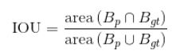

从图形上来看，可以表示为下图。

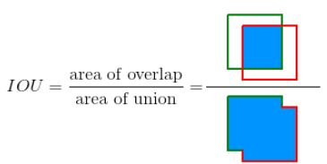

## 1.2 TP、FP、FN、TN

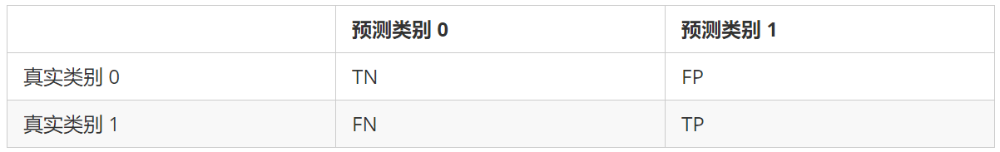

- **True Positive (TP)**:  IOU>=阈值的检测框
- **False Positive (FP)**: IOU<阈值的检测框
- **False Negative (FN)**: 未被检测到的GT
- **True Negative (TN)**: 忽略不计

注：阈值通常取0.5

## 1.3 Precision、Recall

precision指预测为1的样本有多少是对的

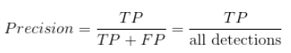

recall指本来是1的样本有多少预测对了

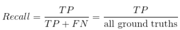

## 1.4 PR Curve

**PR曲线用途**：当confidence阈值改变时，衡量模型的performance

**好模型的标志**：PR曲线鼓大（靠近右上方），recall变大时precision下降小，意味着模型不需要通过预测更多的BBOX来检测出GT。对于好的模型，当confidence阈值改变，precision和recall都保持在较高水平

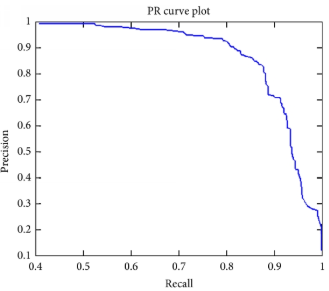

## 1.5 Average Precision

**AP**：PR曲线下面积的近似，是一个0~1之间的数值，也可用来衡量模型的performance

**AP VS PR曲线**：

* PR曲线比较直观，但由于曲线的上下震荡，不方便比较不同模型的PR曲线
* AP是一个数字，模型的AP大，则模型更好，方便比较不同模型

对于AP的计算，VOC采用过两种不同方法, 详见[The PASCAL Visual Object Classes Challenge 2010 (VOC2010) Development Kit](https://link.zhihu.com/?target=http%3A//host.robots.ox.ac.uk/pascal/VOC/voc2010/htmldoc/devkit_doc.html%23SECTION00044000000000000000)

### 1.5.1 11点插值法

VOC2010以前，选取当Recall >= 0, 0.1, 0.2, ..., 1共11个点时的Precision最大值，AP是这11个Precision的平均值，此时只由11个点去近似PR曲线下面积。

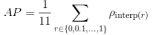

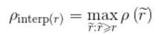

$\rho(\tilde{r})$是recall = $\tilde{r}$时的precision

### 1.5.2 所有点插值法

VOC2010及以后，需要针对每一个不同的Recall值（包括0和1），选取其大于等于这些Recall值时的Precision最大值，然后计算PR曲线下面积作为AP值：

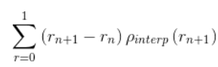

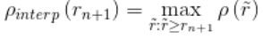

$\rho(\tilde{r})$是recall = $\tilde{r}$时的precision

由于此方法用了所有点去近似PR曲线下面积，计算的AP比11点插值法更准确。

# 2 AP计算示例

对某一类，共7张图片，15个GT（绿色框），24个预测BBOX（红色框），见下图，图中百分比为预测边框属于该类别的置信度。

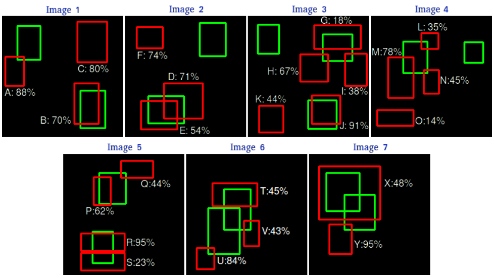

## 2.1 TP、FP判定

* 对于每个BBOX，如果它与图片内某GT的IOU>0.3, 则该BBOX为TP，否则为FP
* 一个GT只能对应一个TP，如果一个GT对应了多个满足IOU阈值的BBOX，我们仅选取置信度最高的BBOX作为该GT的TP

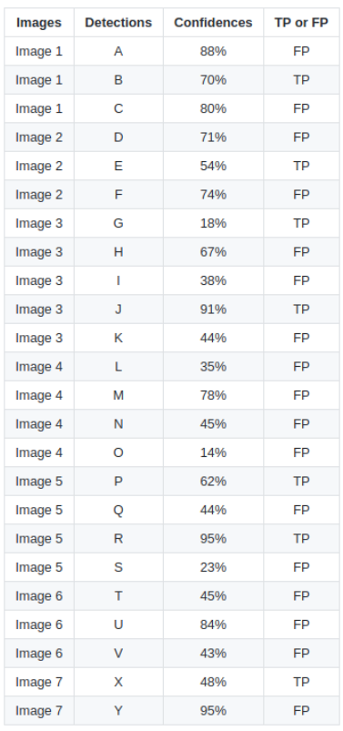

## 2.2 recall & precision计算

利用confidence给BBOX排序，对每个BBOX都计算对应的precision和recall值，例如：

* 对BBOX R，precision = 1/1 = 1，recall = 1/15=0.0666
* 对BBOX Y，precision = 1/2 = 0.5，recall = 1/15=0.0666
* 对BBOX J，precision = 2/3 = 0.6666，recall = 2/15=0.1333

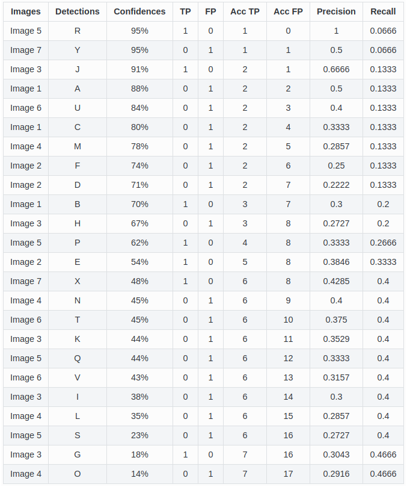

## 2.3 AP计算

### 2.3.1 11点插值法

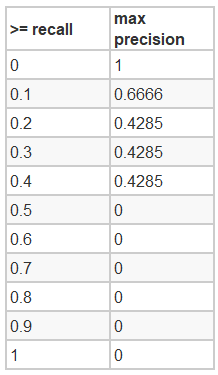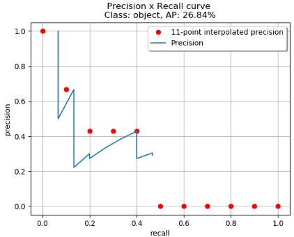

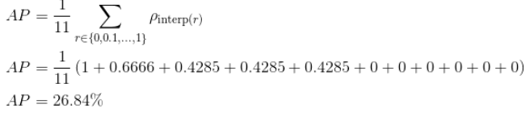

### 2.3.2 所有点插值法

将上表中24个BBOX对应的24个precision和recall画呈散点图并连线就是PR曲线，见下图左。垂线的recall无变化，斜线都recall有变化，找到recall变化的位置区间，每个recall区间对应的precision是>=该recall区间上限时对应的最大precision，见下图右。

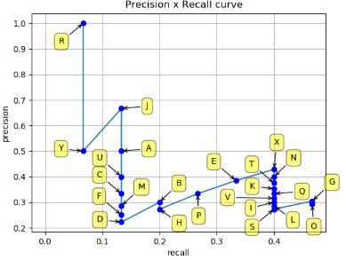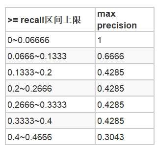

AP是通过计算recall变化位置对应的矩形面积和来近似PR曲线的下面积。因此，AP=A1+A2+A3+A4。

注：A3中包含了多个recall变化区间，但其对应的precision的最大值都是0.4285，因此将多个区间的矩形块合并成了一个矩形块A3

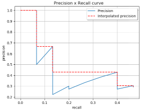                  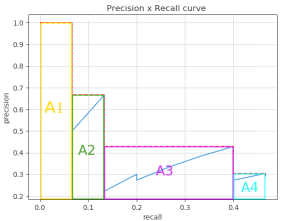

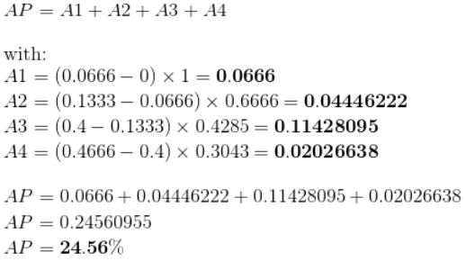

# 3 reference

<https://github.com/rafaelpadilla/Object-Detection-Metrics#different-competitions-different-metrics>

<https://medium.com/@jonathan_hui/map-mean-average-precision-for-object-detection-45c121a31173>

<https://www.zhihu.com/question/53405779>