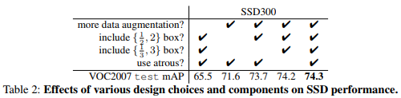
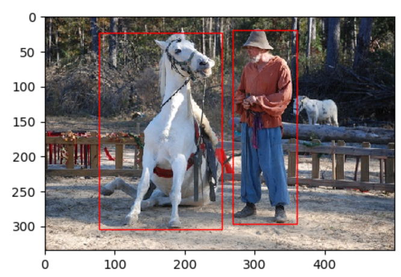
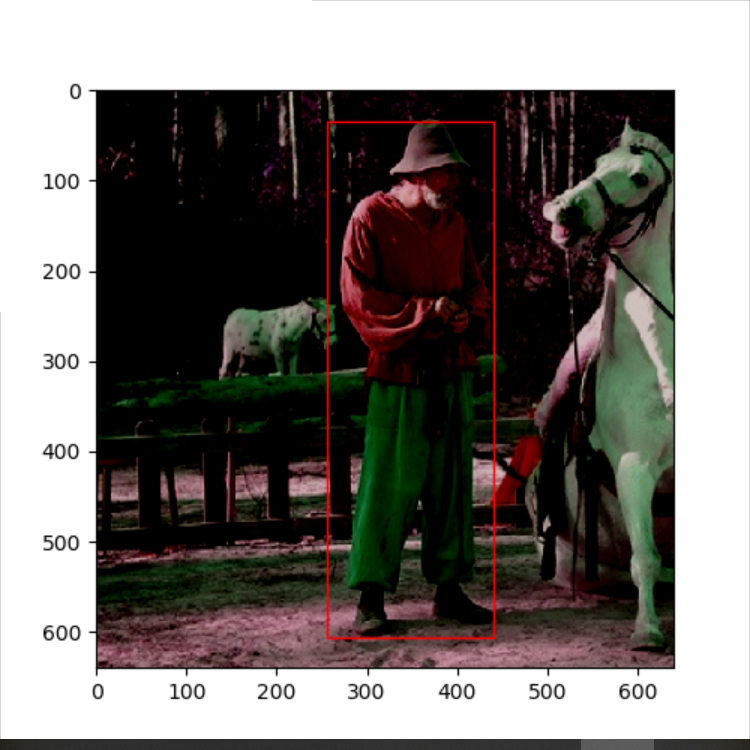
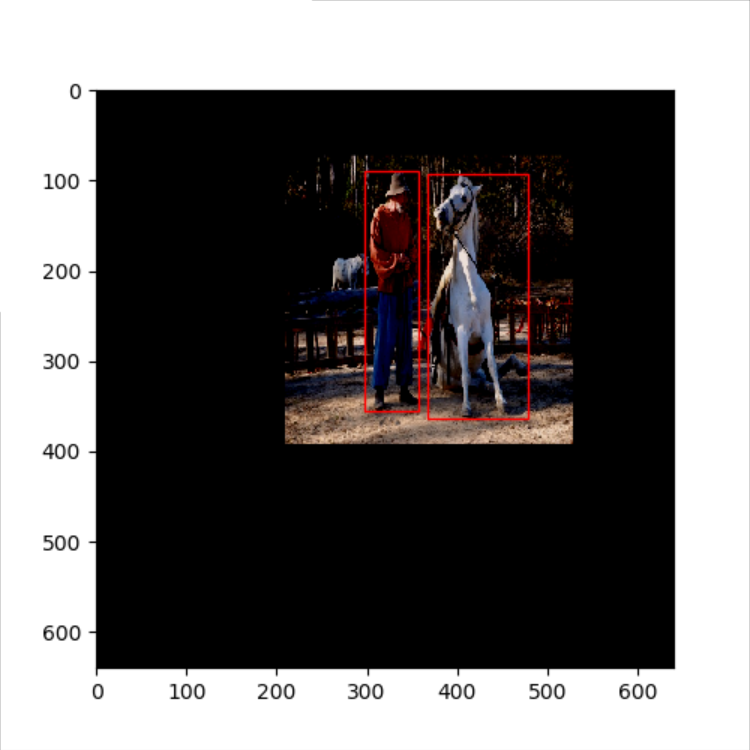
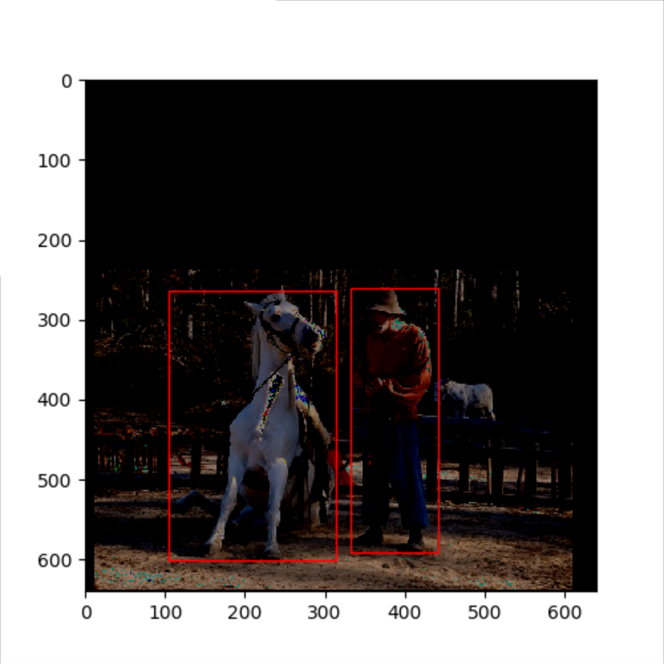
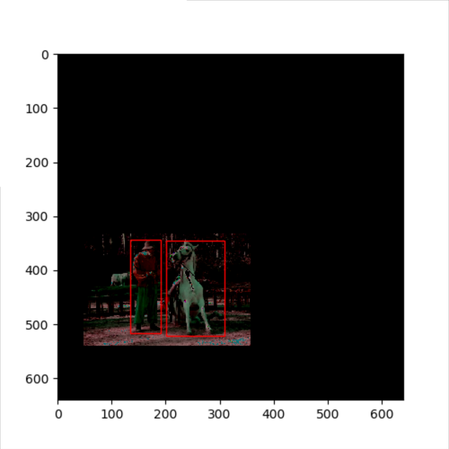

> 本文pyhton代码参考：[DSFD数据增广](https://github.com/TencentYoutuResearch/FaceDetection-DSFD/blob/master/utils/augmentations.py)，RandomBaiduCrop类的代码有重构，其他基本一致。

## SSD数据增广

SSD的数据增广堪称经典，论文中，使用数据增广的SSD在VOC2007上提升了8.8%的准确率。SSD做数据增广的初衷是为了减小网络对输入gt size的敏感性，即，不管gt大小如何变化，网络都可以较好检测。



### 实现思路

每一张训练图像，随机的进行如下几种选择采样：

- 使用原始的图像
- 随机采样一个patch，与gt之间最小的 jaccard overlap 为：0.1，0.3，0.5，0.7 或 0.9。
- 随机采样一个patch

采样的 patch 是原始图像大小比例是 [0.1，1.0]（代码中是 [0.3，1.0]），宽高比在 0.5 到 2之间。当 gt的 中心在采样的 patch 中时，保留该gt，否则删除该gt。

### python代码

- 1、 设置7组iou条件[None,min(iou)>0.1, min(iou)>0.3, min(iou)>0.5, min(iou)>0.7, min(iou)>0.9,(None,None)]
  - None表示直接用原图，不进行数据增广
  - (None,None)表示随机crop，不需要crop出来的区域满足iou条件
- 2、对于一张输入图片，随机许选取1组iou条件
- 3、while循环：如果a，b，c中有任意一个步骤不满足条件则进入下一次循环，至多50次
  - a、对size为weight * height的图片，计算crop size w，h（均比原图小），且h / w < 0.5 or h / w > 2 
  - b、在图中随机crop w * h的rect，若rect满足step2中的iou条件，则crop rect
  - c、对和rect有重叠区域的gt，如果其center在rect中则保留，否则删除该gt，删除后如果rect中还有gt，则输出crop rect、rect中的gt、gt对应label

```python
class RandomSSDCrop(object):
    def __init__(self):
        self.sample_options = (
            # using entire original input image
            None,
            # sample a patch s.t. MIN jaccard w/ obj in .1,.3,.5,.7,.9
            (0.1, None),
            (0.3, None),
            (0.5, None),
            (0.7, None),
            (0.9, None),
            # randomly sample a patch
            (None, None),
        )

    def __call__(self, image, boxes=None, labels=None):
        """
        :param image: 3-d array,channel last
        :param boxes: 2-d array,(num_gt,(x1,y1,x2,y2)
        :param labels: 1-d array(num_gt)
        :return:
        """
        height, width, _ = image.shape
        while True:
            # randomly choose a mode
            mode = random.choice(self.sample_options)
            if mode is None:
                return image, boxes, labels

            min_iou, max_iou = mode
            if min_iou is None:
                min_iou = float('-inf')
            if max_iou is None:
                max_iou = float('inf')

            # max trails (50)
            for _ in range(50):
                current_image = image

                w = random.uniform(0.3 * width, width)
                h = random.uniform(0.3 * height, height)

                # aspect ratio constraint b/t .5 & 2
                if h / w < 0.5 or h / w > 2:
                    continue

                left = random.uniform(width - w)
                top = random.uniform(height - h)

                # convert to integer rect x1,y1,x2,y2
                rect = np.array([int(left), int(top), int(left + w), int(top + h)])

                # calculate IoU (jaccard overlap) b/t the cropped and gt boxes
                overlap = jaccard_numpy(boxes, rect)

                # is min and max overlap constraint satisfied? if not try again
                if overlap.min() < min_iou and max_iou < overlap.max():
                    continue

                # cut the crop from the image
                current_image = current_image[rect[1]:rect[3], rect[0]:rect[2], :]

                # keep overlap with gt box IF center in sampled patch
                centers = (boxes[:, :2] + boxes[:, 2:]) / 2.0

                # mask in all gt boxes that above and to the left of centers
                m1 = (rect[0] < centers[:, 0]) * (rect[1] < centers[:, 1])

                # mask in all gt boxes that under and to the right of centers
                m2 = (rect[2] > centers[:, 0]) * (rect[3] > centers[:, 1])

                # mask in that both m1 and m2 are true
                mask = m1 * m2

                # have any valid boxes? try again if not
                if not mask.any():
                    continue

                # take only matching gt boxes
                current_boxes = boxes[mask, :].copy()

                # take only matching gt labels
                current_labels = labels[mask]

                # should we use the box left and top corner or the crop's
                current_boxes[:, :2] = np.maximum(current_boxes[:, :2],
                                                  rect[:2])
                # adjust to crop (by substracting crop's left,top)
                current_boxes[:, :2] -= rect[:2]

                current_boxes[:, 2:] = np.minimum(current_boxes[:, 2:],
                                                  rect[2:])
                # adjust to crop (by substracting crop's left,top)
                current_boxes[:, 2:] -= rect[:2]

                return current_image, current_boxes, current_labels

```

当然，除了以上的主函数，SSD数据增广的整体流程还包括了其他一些操作，例如：修改图片的brightness，contrast，saturation，hue，reordering channels，expand，随机翻转，resize，详见[augment.py](https://github.com/embracesource-cv-com/dual_shot_face_detector/blob/master/prepare_data/augment.py)。

### 效果展示

#### 原图



#### 增广示例1



#### 增广示例2



## PyramidBox数据增广

PyramidBox于2018年由baidu发表，文中提出名为Data-anchor-sampling的数据增广方法，该方法与SSD数据增广类似，但Data-anchor-sampling考虑到了gt大小，anchor size和随机裁剪之间的关系，理论上数据增广后可以匹配到更多的positive anchor。

### 实现思路

anchor尺寸通常不连续，例如[16, 32, 64, 128, 256, 512]，但gt尺寸是连续的，即图片中gt的size很多变。为保证随机裁剪后anchor还可以较好的gt，Data-anchor-sampling提出按anchor 尺寸/gt 尺寸resize原图后，再进行随机裁剪。

**例如：**

* 原图尺寸为240 * 240，图中gt 尺寸为120 *120, 此时和gt最匹配的anchor尺寸为128
* 假设选定anchor 尺寸64，resize ratio= 64/120≈0.5
* 经resize后原图尺寸变为120*120，其中gt尺寸变为60 * 60，此时gt最匹配的anchor尺寸为64
* 之后在resize的基础上进行随机裁剪，不会改变gt尺寸，这样裁剪后的gt仍然可以较好匹配到anchor；反之如果直接在原图上进行随机裁剪，裁剪后gt的size可能会和给定的anchor尺寸相差甚远，不容易匹配到正anchor


### python 代码

- 图片resize
  - 给定anchor尺寸[16, 32, 64, 128, 256, 512]
  - 对图片中的gt计算面积、平均边长（sqrt（面积）
  - 随机选取一个gt，假设平均边长为120，找到与其平均边长最近的anchor尺寸，即：128
  - 在[16, 32, 64, 128, 256]（该list为小于128的anchor尺寸+ 大于128的1个anchor尺寸组成）中随机选取一个anchor尺寸，假设target anchor=64
  - 计算resize ratio= 64/120≈0.5
  - 利用ratio resize 图片并相应改变gt坐标
- 图片crop
  - 在resize后的图片上随机选取1个crop box, 其w=h=crop_size, 保证crop box至少完整覆盖1个gt，获得crop后的image
  - 对和crop box有重叠区域的gt，如果其center在crop box中则保留，否则删除该gt
- 输出crop后的image，center在crop box中的gt，gt对应label

```python
class RandomBaiduCrop(object):
    def __init__(self, size):
        self.maxSize = 12000  # max size
        self.size = size

    def __call__(self, image, boxes=None, labels=None):
        """
        :param image: 3-d array,channel last
        :param boxes: 2-d array,(num_gt,(x1,y1,x2,y2)
        :param labels: 1-d array(num_gt)
        :return:
        """
        # resize original image and transfer the gt accordingly
        height, width, _ = image.shape
        box_area = (boxes[:, 2] - boxes[:, 0] + 1) * (boxes[:, 3] - boxes[:, 1] + 1)
        # print(boxes,box_area)
        rand_idx = random.randint(len(box_area))
        side_len = box_area[rand_idx] ** 0.5

        anchors = np.array([16, 32, 64, 128, 256, 512])
        distances = abs(anchors - side_len)
        anchor_idx = np.argmin(distances)
        target_anchor = random.choice(anchors[0:min(anchor_idx + 1, 5) + 1])

        ratio = float(target_anchor) / side_len
        ratio = ratio * (2 ** random.uniform(-1, 1))  
        if int(height * ratio * width * ratio) > self.maxSize * self.maxSize:
            ratio = (self.maxSize * self.maxSize / (height * width)) ** 0.5

        interp_methods = [cv2.INTER_LINEAR, cv2.INTER_CUBIC, cv2.INTER_AREA, cv2.INTER_NEAREST, cv2.INTER_LANCZOS4]
        interp_method = random.choice(interp_methods)
        image = cv2.resize(image, None, None, fx=ratio, fy=ratio, interpolation=interp_method)
        boxes = boxes * ratio

        # randomly select 1 crop box which covers the selected gt
        height, width, _ = image.shape
        sample_boxes = []
        gt_x1, gt_y1, gt_x2, gt_y2 = boxes[rand_idx, :]
        crop_w = crop_h = self.size

        # randomly select a crop box
        if crop_w < max(height, width):
            crop_x1 = random.uniform(gt_x2 - crop_w, gt_x1)
            crop_y1 = random.uniform(gt_y2 - crop_h, gt_y1)
        else:
            crop_x1 = random.uniform(width - crop_w, 0)
            crop_y1 = random.uniform(height - crop_h, 0)
        crop_x1 = math.floor(crop_x1)
        crop_y1 = math.floor(crop_y1)
        choice_box = np.array([int(crop_x1), int(crop_y1), int(crop_x1 + crop_w), int(crop_y1 + crop_h)])

        # perform crop, keep gts with centers lying inside the cropped box
        pil_img = Image.fromarray(image.astype(np.uint8))
        current_image = np.array(pil_img.crop([i for i in choice_box]))

        c_xs = (boxes[:, 0] + boxes[:, 2]) * 0.5
        c_ys = (boxes[:, 1] + boxes[:, 3]) * 0.5
        m1 = (choice_box[0] < c_xs) * (c_xs < choice_box[2])
        m2 = (choice_box[1] < c_ys) * (c_ys < choice_box[3])
        mask = m1 * m2
        current_boxes = boxes[mask, :].copy()
        current_labels = labels[mask]

        current_boxes[:, :2] = np.maximum(current_boxes[:, :2], choice_box[:2])  # make sure gt is inside the crop
        current_boxes[:, 2:] = np.minimum(current_boxes[:, 2:], choice_box[2:])
        current_boxes[:, :2] -= choice_box[:2]
        current_boxes[:, 2:] -= choice_box[:2]
        return current_image, current_boxes, current_labels
```

除了以上的主函数，和SSD数据增广一样，PyramidBox数据增广的整体流程还包括了其他一些操作，例如：修改图片的brightness，contrast，saturation，hue，reordering channels，随机翻转，详见[augment.py](https://github.com/embracesource-cv-com/dual_shot_face_detector/blob/master/prepare_data/augment.py)

### 效果展示

#### 增广示例1



#### 增广示例2

